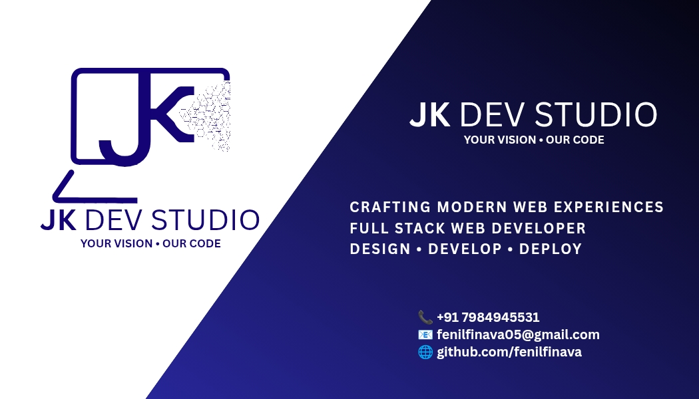

  

  <h1>💎 Sparklyn Jewels E-Commerce</h1>
  
  
<strong>A Premium Lab-Grown Diamond Jewelry E-Commerce Platform</strong>

  

    <a href="https://sparklyn-jewels-ecommerce.vercel.app"><strong>View Live Demo »</strong></a>
  

  

    
    
    
    
  

---

## 🚀 About the Project
**Sparklyn Jewels** is a full-stack, enterprise-grade e-commerce application designed to deliver a luxury shopping experience. Built with modern web technologies, it features a highly dynamic frontend, a robust backend architecture, and a secure admin dashboard to manage complex jewelry inventories like custom metals, dynamic pricing, and ring sizes.

### ✨ Key Features
- **Modern User Experience**: Fluid animations, hover image galleries, and premium UI components built with Tailwind CSS.
- **Dynamic Product Variants**: Advanced product management handling multiple metals (18K, 24K, Platinum), specific metal pricing, and dynamic ring/bracelet sizes.
- **Custom Admin Dashboard**: A secure, JWT-protected backend CMS for admins to manage inventory, categories, orders, and storefront hero sections.
- **Cloud Architecture**: Seamless image uploads powered by Cloudinary, with MongoDB Atlas for scalable database management.

---

## 👨‍💻 Developed By

  
    
  <h2><strong>JK Dev Studio</strong></h2>
  
<em>Crafting High-Performance Digital Solutions & Web Applications</em>

This project was architected and developed by **JK Dev Studio**, a web development startup focused on creating scalable, modern, and high-converting web applications for businesses. We specialize in the MERN stack and Next.js ecosystem, helping brands establish a powerful digital presence.

*Are you looking to build a premium web application for your business?*  
**Get in touch to bring your vision to life.**

---

## 🛠 Tech Stack

* **Frontend:** Next.js (App Router), React 19, Tailwind CSS, Zustand (State Management)
* **Backend:** Node.js, Express.js, JWT Authentication
* **Database & Storage:** MongoDB Atlas, Mongoose, Cloudinary
* **Deployment:** Vercel (Frontend), Render (Backend)

---

  
Made with ❤️ by JK Dev Studio

